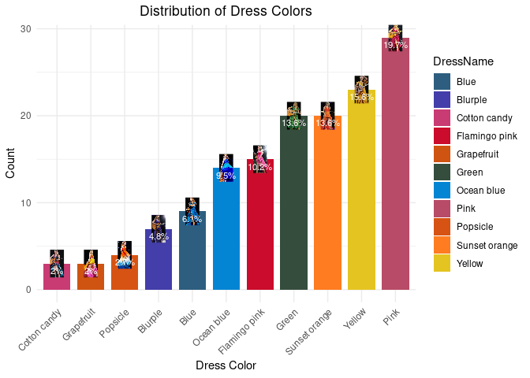

## Overview

*Could a Swiftie in the crowd reliably predict the mood of the surprise
songs based on the color of Swift’s dress?* Looking the relationship
between Taylor Swift’s wardrobe choices and her surprise song selection
during the Eras Tour.

## Surprise Song Outfits

<table border="1">
<tr>
<th>
Blue
</th>
<th>
Blurple
</th>
<th>
Cotton Candy
</th>
<th>
Flamingo Pink
</th>
<th>
Grapefruit
</th>
<th>
Green
</th>
<th>
Ocean Blue
</th>
<th>
Pink
</th>
<th>
Popsicle
</th>
<th>
Sunset Orange
</th>
<th>
Yellow
</th>
</tr>
<tr>
<td>

</td>
<td>

</td>
<td>

</td>
<td>

</td>
<td>

</td>
<td>

</td>
<td>

</td>
<td>

</td>
<td>

</td>
<td>

</td>
<td>

</td>
</tr>
</table>

    require(tidyverse)
    ## Loading required package: tidyverse
    ## ── Attaching core tidyverse packages ──────────────────────── tidyverse 2.0.0 ──
    ## ✔ dplyr     1.1.4     ✔ readr     2.1.5
    ## ✔ forcats   1.0.0     ✔ stringr   1.5.1
    ## ✔ ggplot2   3.5.1     ✔ tibble    3.2.1
    ## ✔ lubridate 1.9.4     ✔ tidyr     1.3.1
    ## ✔ purrr     1.0.4     
    ## ── Conflicts ────────────────────────────────────────── tidyverse_conflicts() ──
    ## ✖ dplyr::filter() masks stats::filter()
    ## ✖ dplyr::lag()    masks stats::lag()
    ## ℹ Use the conflicted package (<http://conflicted.r-lib.org/>) to force all conflicts to become errors
    require(ggimage)
    ## Loading required package: ggimage
    surpriseSongsDressColours <- "raw_data/surprise_songs.xlsx"
    surpriseSongsDressColours <- readxl::read_excel(surpriseSongsDressColours, sheet = "List")

    pianoSongsData <- surpriseSongsDressColours[surpriseSongsDressColours$Instrument == "Piano",]
    dressColorMapping <- unique(pianoSongsData %>% select(DressName, ColourHex1))
    colorPaletteDresses <- setNames(dressColorMapping$ColourHex1, dressColorMapping$DressName)
    pianoSongsData$Date <- as.Date(pianoSongsData$Date)
    pathToDressColours <- "dress_images/images_high_res/cropped/"
    pianoSongsData %>%
      count(DressName) %>%
      mutate(
        percentage = n / sum(n) * 100,
        imagePath = case_when(
          DressName == "Pink" ~paste0(pathToDressColours, "pink.jpg"),
          DressName == "Green" ~paste0(pathToDressColours, "green.jpg"),
          DressName == "Yellow" ~paste0(pathToDressColours, "yellow.jpg"),
          DressName == "Blue" ~paste0(pathToDressColours, "blue.jpg"),
          DressName == "Flamingo pink" ~ paste0(pathToDressColours,"flamingo_pink.jpg"),
          DressName == "Ocean blue" ~ paste0(pathToDressColours,"ocean_blue.jpg"),
          DressName == "Sunset orange" ~ paste0(pathToDressColours,"sunset_orange.jpg"),
          DressName == "Cotton candy" ~paste0(pathToDressColours, "cotton_candy.jpg"),
          DressName == "Blurple" ~paste0(pathToDressColours, "blurple.jpg"),
          DressName == "Grapefruit" ~ paste0(pathToDressColours,"grapefruit.jpg"),
          DressName == "Popsicle" ~ paste0(pathToDressColours,"popsicle.jpg"),
          # Add more conditions for each DressName
          TRUE ~ NA_character_
        )
      ) -> pianoSongsDataWithImages

    ggplot(pianoSongsDataWithImages, aes(x = reorder(DressName, n), y = n, fill = DressName)) +
      geom_bar(stat = "identity", width = 0.8) + # Adjust bar width if needed
      geom_image(
        aes(image = imagePath), 
        size = 0.1,          # Adjust size relative to the bar's width
        by = "height"        # Scale the images based on the bar height
      ) +
      geom_text(
        aes(label = paste0(round(percentage, 1), "%")), 
        vjust = 1.5,         # Place text inside the bar
        color = "white", 
        size = 3
      ) +
      scale_fill_manual(values = colorPaletteDresses) +
      theme_minimal() +
      labs(
        title = "Distribution of Dress Colors",
        x = "Dress Color",
        y = "Count"
      ) +
      theme(
        axis.text.x = element_text(angle = 45, hjust = 1),
        plot.title = element_text(hjust = 0.5)
      )

